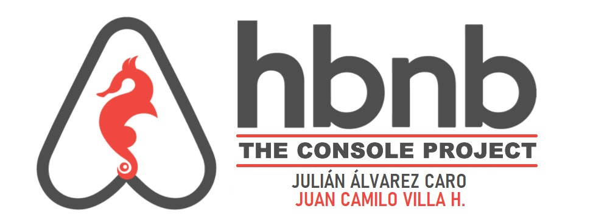

# AirBnB clone - The console

### Contents

* [Description](https://github.com/jcamilovillah/AirBnB_clone#description)
* [Files](https://github.com/jcamilovillah/AirBnB_clone#repository-contents)
* [Usage](https://github.com/jcamilovillah/AirBnB_clone#usage)
* [How to Install](https://github.com/jcamilovillah/AirBnB_clone#how-to-install)
* [Example Usage](https://github.com/jcamilovillah/AirBnB_clone#example-usage)
* [Testing](https://github.com/jcamilovillah/AirBnB_clone#Testing)
* [Authors](https://github.com/jcamilovillah/AirBnB_clone#authors)
---

### Description 
Command interpreter to manipulate data without a visual interface, like in a Shell (perfect for development and debugging)

- Create your data model.
- Manage (create, update, destroy, etc) objects via a console / command interpreter.
- Store and persist objects to a file (JSON file).

The first piece is to manipulate a powerful storage system. This storage engine will give us an abstraction between "My object" and "How they are stored and persisted". This means: from your console code (the command interpreter itself) and from the front-end and RestAPI you will build later, you won’t have to pay attention (take care) of how your objects are stored.

This abstraction will also allow you to change the type of storage easily without updating all of your codebase.
The console will be a tool to validate this storage engine.

---
### Repository contents
AirBnB clone - The console files:

|   **File**   |   **Description**   |
| -------------- | --------------------- |
|console.py | Command interpreter. |
|base_model.py | Defines all common attributes/methods for other classes. |
|file_storage.py | A class that serializes instances to a JSON file and deserializes JSON file to instances. |
|amenity.py | A class Amenity that inherits from BaseModel. |
|city.py | A class City that inherits from BaseModel. |
|place.py | A class Place that inherits from BaseModel. |
|review.py | A class Review that inherits from BaseModel. |
|state.py | A class State that inherits from BaseModel. |
|user.py | A class User that inherits from BaseModel. |
|tests\ | Contains unittests for the project. |
|README.md | Readme file. |
|AUTHORS | Autors file. |

---
### Usage

#### Basic Usage of The Console
---
| **Function** | **Funcionality** | **Sample Usage** |
| -------------- | ----------------- | ----------------- |
|EOF | Exit the program. | EOF
|all | Prints all string representation of all instances based or not on the class name. | User.all()
|count | Returns count of objects. | User.count()
|create | Creates a new instance of BaseModel, save and print the id. | create User
|destroy | Deletes an instance based on the class name and id. | User.destroy('12345')
|help | Help function. | help
|quit | Exit the program. | quit
|show | Prints the string representation of an instance based on the class name and id. | User.show('12345')
|update | Updates an instance based on the class name and id by adding or updating attribute. | User.update('12345', {'name' : 'CarLuz'})

---
### How to Install
Clone the repositoy below:
```bash
git clone https://github.com/jcamilovillah/AirBnB_clone.git
```
---
### Example Usage

#### Interative Mode:
```
(hbnb) help

Documented commands (type help <topic>):
========================================
EOF  all  count  create  destroy  help  quit  show  update

(hbnb) all MyModel
** class doesn't exist **
(hbnb) show BaseModel
** instance id missing **
(hbnb)create BaseModel
df1ca7e3-a140-4739-b4da-96f87b4e7ee9
(hbnb)all BaseModel
["[BaseModel] (df1ca7e3-a140-4739-b4da-96f87b4e7ee9) {'updated_at': datetime.datetime(2020, 2, 19, 22, 49, 0, 939794), 'created_at': datetime.
datetime(2020, 2, 19, 22, 49, 0, 939700), 'id': 'df1ca7e3-a140-4739-b4da-96f87b4e7ee9'}"]
(hbnb)show BaseModel df1ca7e3-a140-4739-b4da-96f87b4e7ee9
[BaseModel] (df1ca7e3-a140-4739-b4da-96f87b4e7ee9) {'updated_at': datetime.datetime(2020, 2, 19, 22, 49, 0, 939794), 'created_at': datetime.datetime(2020, 2, 19, 22, 49, 0, 939700), 'id': 'df1ca7e3-a140-4739-b4da-96f87b4e7ee9'}
(hbnb) create User
8cf2405e-2837-4a7c-b824-b12a9a0d89b2
(hbnb) destroy BaseModel df1ca7e3-a140-4739-b4da-96f87b4e7ee9
(hbnb) show BaseModel df1ca7e3-a140-4739-b4da-96f87b4e7ee9
** no instance found **
(hbnb) quit
```

#### Non-interactive Mode:
```
$ echo "create User" | ./console.py
(hbnb)063f787b-46ed-4bb8-becc-de0ffde7efed
```

### Testing

Unittests for the HolbertonBnB project are defined in the tests folder. To run the entire test suite simultaneously, execute the following command:
```
$ python3 unittest -m discover tests
```

Alternatively, you can specify a single test file to run at a time:
```
$ python3 unittest -m tests/test_console.py
```
---
## Authors ✒️

<p align="left">
    <h3 align="left"> Julián Álvarez Caro </h3>
      <p align="left">
	   </a>
		<p align="left">
        <a href="https://twitter.com/juliandavidal2" target="_blank">
            
        </a>
        <a href="https://www.linkedin.com/in/julian-alvarezcaro/" target="_blank">
            
        </a>
        <a href="https://medium.com/@julinlvarezcaro" target="_blank">
            
			</a>
			<h3 align="left">Juan Camilo Villa H. </h3>
      		<p align="left">
	   		</a>
			<p align="left">
        <a href="https://twitter.com/jcamilovillah" target="_blank">
            
        </a>
        <a href="https://www.linkedin.com/in/jcamilovillah/" target="_blank">
            
        </a>
        <a href="https://medium.com/@juancamilovilla" target="_blank">
            
			 </a>
</p>
